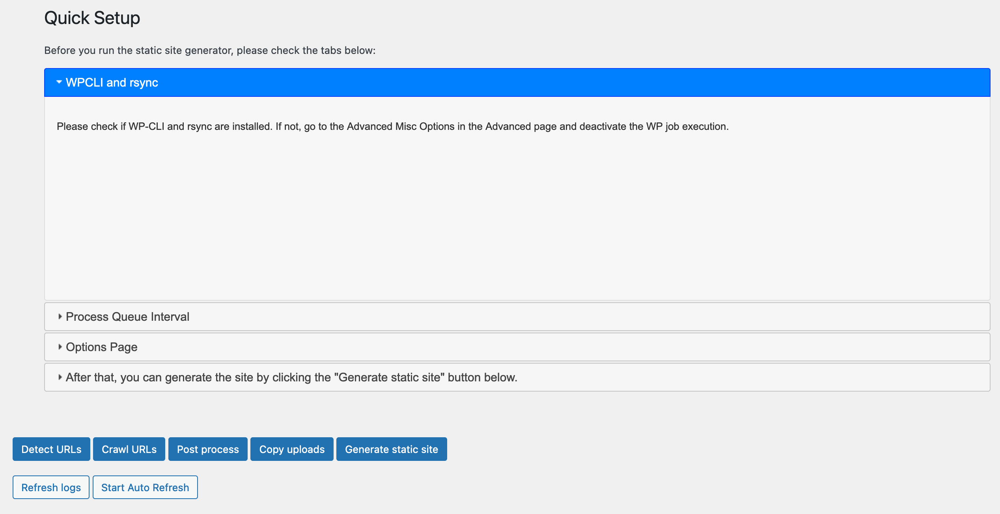
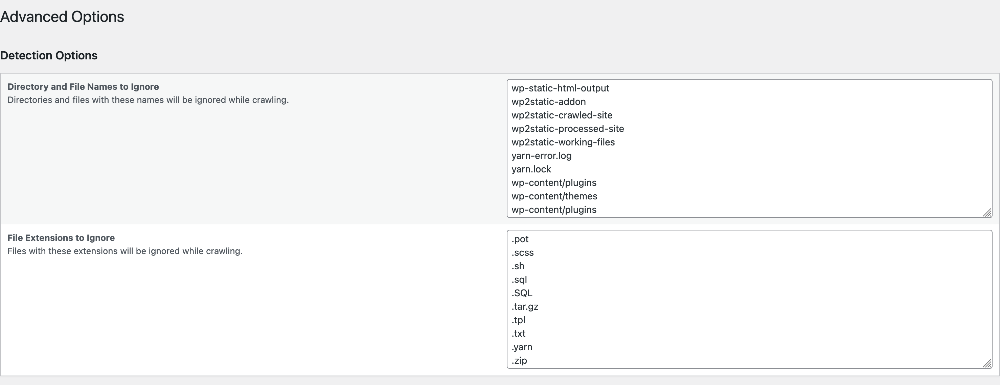
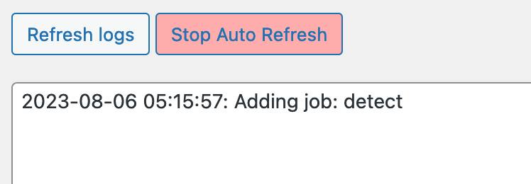
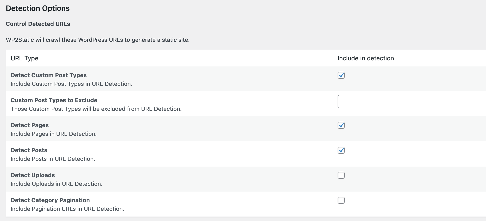
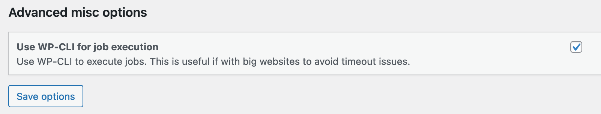

<!--
 Copyright 2023 mohamedtita

 Licensed under the Apache License, Version 2.0 (the "License");
 you may not use this file except in compliance with the License.
 You may obtain a copy of the License at

     http://www.apache.org/licenses/LICENSE-2.0

 Unless required by applicable law or agreed to in writing, software
 distributed under the License is distributed on an "AS IS" BASIS,
 WITHOUT WARRANTIES OR CONDITIONS OF ANY KIND, either express or implied.
 See the License for the specific language governing permissions and
 limitations under the License.
-->

# Staticmirror

Static mirror is an experimental fork of version (7.1.7) of WP2Static Wordpress plugin.

The idea behind this fork is to test some fixes and new features for specialized use cases we encountered while working on creating mirrors for censored independent media and human rights websites working in hostile or oppressive environment.
for example, we added some fixes to better support multilingual websites, and implemented work-arounds for certain conflicts and issues that's caused by some widely-used Wordpress plugins.
We are also trying to minimize the time needed for updating the static mirror with newly published content which will be highly beneficial for frequently updated websites such as news websites.

**fixes and changes**

* Split the export process into multiple stages, each stage can be triggered manually to avoid timeout errors with large websites and/or low capacity servers.
* Reduced the time needed for URL detection.
* improved handling of 404 error.
* using wpcli optionally to execute the export.
* fixed issues with pagination URLs in URL detection.
* fixed issues with sitemap detection.
* fixed issues with url detection on multilingual websites
* improved compatibility with WPML
* Added UI option to ignore /uploads directory

**Todo**

* Integrate the publishing features back into the plugin
* add a feature to browse the exported site directly from the browser, for testing purposes.

# Installation

**Minimum php version required : 7.3**

* Download the zip [archive](https://github.com/icaruslab/staticmrr/archive/refs/heads/main.zip)
* Open Wordpress website admin dashboard
* Go to Plugins > Add New > Upload Plugin
* After upload the .zip file activate the plugin

# Screenshots

**Export stages can be triggered individually**

**Enable Auto Refresh to display updated logs automatically**

**Category Pagination detection**

**Use WP-CLI to execute the export command (Experimental)**

# Disclaimer

This code is unstable and developed for specific testing purposes, it is not meant for production environments and comes with no guarantees or support.
The changes to the plugin were tested in the context of researching and developing internet censorship circumvention tools and methods for independent media and human rights organizations.

[Read More](https://fightcensorship.tech/docs/overview/)